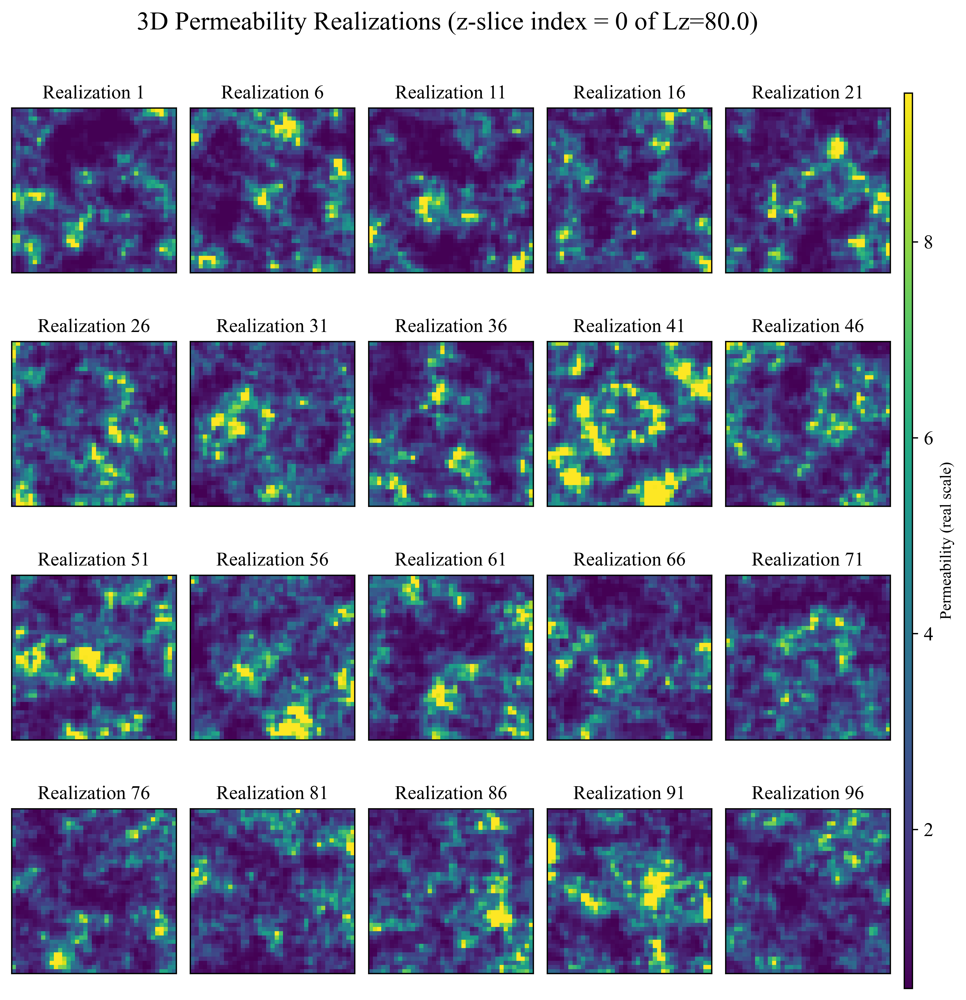

# 3D Karhunen-Loève Expansion Tool for Reservoir Permeability Field Generation

## Theory

### Karhunen-Loève Expansion

The Karhunen-Loève expansion is a method for representing a stochastic process as an infinite linear combination of orthogonal functions. In the context of reservoir modeling, it is used to generate multiple realizations of spatially correlated permeability fields.

For a random field  with known mean  and covariance function , the KL expansion is given by:

<!--
$$K(x) = \mu(x) + \sum_{i=1}^{\infty} \sqrt{\lambda_i} \xi_i \phi_i(x)$$
-->


Where:
-  and  are eigenvalues and eigenfunctions of the covariance function.
-  are independent standard normal random variables.
- In practice, the infinite sum is truncated to a finite number of terms based on an energy threshold.

### Log-Normal Permeability Model

Since permeability is strictly positive, we model it as a log-normal field. If <!--
$Z(x)$
-->  is a normal random field, then <!--
$K(x) = e^{Z(x)}$
-->
 is log-normal. The real distribution parameters are related to the log-normal distribution parameters by:

<!--
$$\sigma_{log} = \sqrt{\ln(1 + (\sigma_{real}/\mu_{real})^2)}$$
$$\mu_{log} = \ln(\mu_{real}) - 0.5\sigma_{log}^2$$
-->


Where  and  are the desired mean and standard deviation of the physical permeability field.

### Conditional Simulation

The implementation supports conditional simulation. This can be used to ensure that the generated realizations honor known permeability values at specific locations, e.g., at well locations where the property is known with high certainty from core, well log data, pressure transient tests, etc. This is achieved through a kriging adjustment:

<!--
$$K_{cond}(x) = K_{uncond}(x) + \mathbf{C}_{x,obs} \mathbf{C}_{obs,obs}^{-1} (\mathbf{z}_{obs} - \mathbf{z}_{uncond,obs})$$
-->
<p align="center"></p>

Where:
-  is the conditioned field at location .
-  is the unconditioned field at location .
-  is the covariance between location  and observation locations.
-  is the covariance matrix of observation locations.
-  are the observed log-permeability values.
-  are the unconditioned field values at observation locations.



*Figure 1: KL Expansion for 20 selected realizations.*

## Implementation

The implementation consists of two main Python modules:

### 1. KL_expansion.py

This module provides the core functionality for generating permeability realizations using the KL expansion. This is a standalone module that can be used to generate realizations for any reservoir model. Key functions:

- `generate_kl_log_normal_real_params_3D()`: Generates multiple 3D log-normal permeability field realizations.
- `plot_realizations_3D()`: Visualizes 2D slices of the 3D realizations.
- `plot_model_3d_grid()`: Creates 3D voxel visualizations of permeability fields.

### 2. kl_realizations_generator.py

This module provides a higher-level wrapper interface for generating, saving, and organizing KL realizations. Key features:

- `KLConfig` class: Configuration settings for the KL expansion.
- Functions for saving realizations in various formats (numpy arrays, .dat files).
- Data splitting functions for organizing realizations into training, validation, and test datasets.
- Directory structure creation with unique identifiers based on configuration hash.

The module is integrated with other modules in the processing pipeline for generating realizations, which are then used to train AI-based SRMs.

### 3. default_configurations.py

This module contains default configuration settings for various aspects of the AI-based SRM including the architecture of the AI-based SRM, optimizer settings and data processing pipeline. It also contains the characterization parameters for the reservoir, fluid, and well configurations, for which the AI-based SRM is developed.

- General settings (working directory, data types, normalization methods).
- Reservoir properties (dimensions, grid size, permeability statistics).
- Well configurations, including shut-in and production sequences.
- Data splitting parameters.
- AI-based SRM architecture.
- Optimizer settings.
- Data processing pipeline.

## Usage

```python
from KL_expansion import generate_kl_log_normal_real_params_3D, plot_realizations_3D, plot_model_3d_grid
import numpy as np

# Example usage: Generate 100 realizations of a 3D permeability field with conditional values
n_realizations = 100
permeability_fields_3D, num_modes, grid = generate_kl_log_normal_real_params_3D(
    n_realizations,
    Nx=39, Ny=39, Nz=1,
    Lx=2900.0, Ly=2900.0, Lz=80.0,
    real_mean=3.0, real_std=3,
    corr_length_fac=0.1, energy_threshold=0.95,
    seed=2000,
    reverse_order=False,
    cond_values={
        (29, 29, 0): 2.0, 
        (29, 9, 0): 1.5, 
        (9, 9, 0): 1.0, 
        (9, 29, 0): 0.5
    },
    dtype=np.float32
)

# Plot specified 2D slices from the 3D realizations (slicing along the z dimension)
plot_realizations_3D(
    permeability_fields_3D,
    realization_indices=(0, 100, 5),  # Plot every 5th realization
    z_slices=[0],  # Plot the first z-slice
    Lx=2900.0, Ly=2900.0, Lz=80.0,
    title="3D Permeability Realizations"
)

# Create a 3D grid (voxel) visualization of the first realization
plot_model_3d_grid(
    permeability_fields_3D, grid,
    Lx=2900.0, Ly=2900.0, Lz=80.0,
    sample_index=0, cmap='viridis'
)
```

## References

1. Karhunen, K. (1947). Über lineare Methoden in der Wahrscheinlichkeitsrechnung. Annales Academiae Scientiarum Fennicae, Series A1: Mathematica-Physica.
2. Loève, M. (1978). Probability Theory Vol. II (4th ed.). Springer-Verlag.
3. Zhang, D. (2002). Stochastic Methods for Flow in Porous Media: Coping with Uncertainties. Academic Press.
4. Victor C. Molokwu, Bonaventure C. Molokwu and Mahmoud Jamiolahmady. (2024). Application and effects of physics-based and non-physics-based regularizations in artificial intelligence-based surrogate modelling for highly compressible subsurface flow. Geoenergy Science and Engineering. https://doi.org/10.1016/j.geoen.2023.212474
